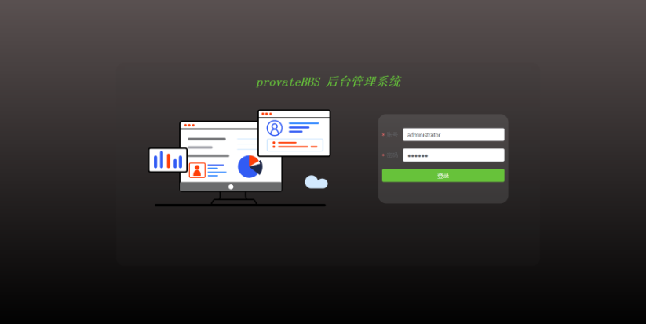
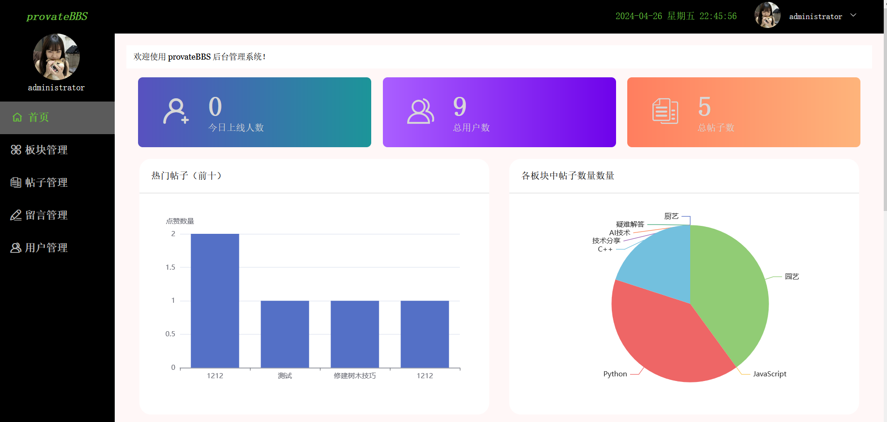
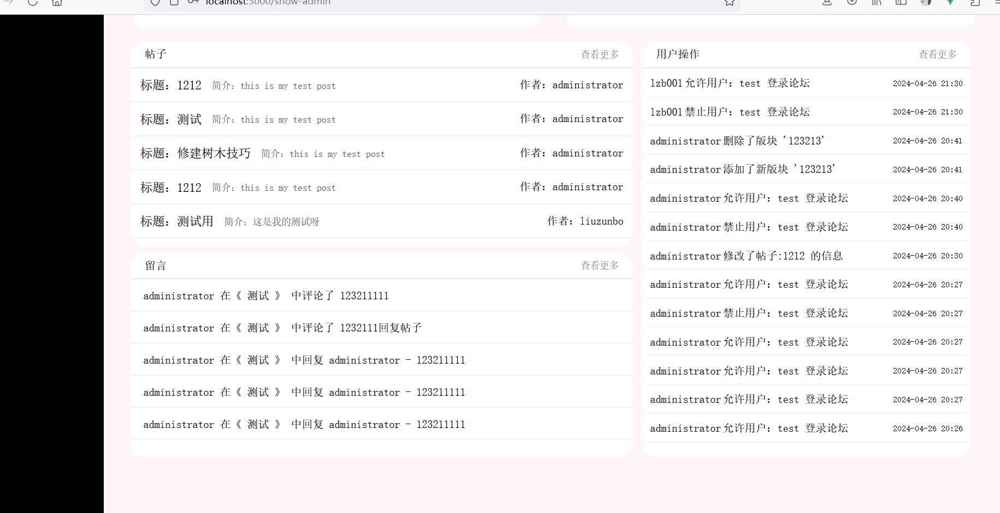
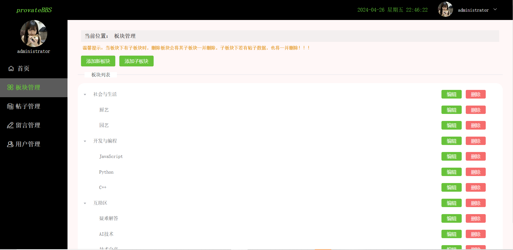
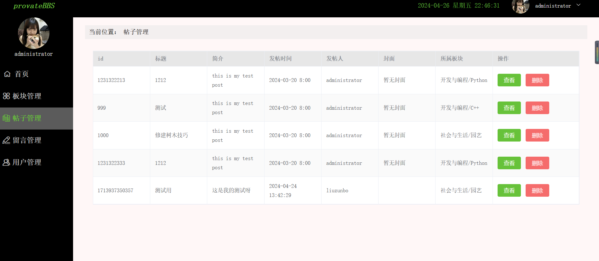
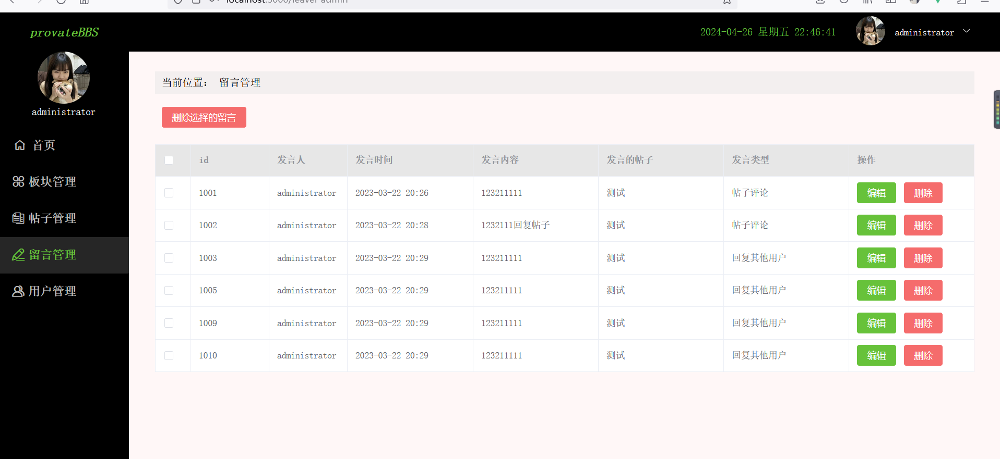
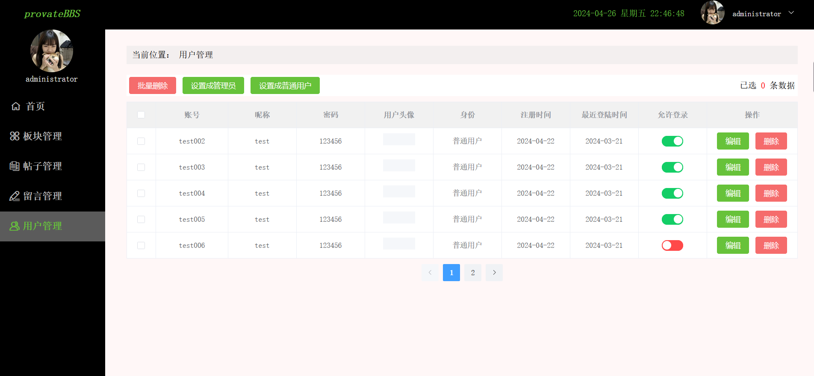

# provate-bbs-admin

## 前言

本项目做完之前发的项目provate-bbs的后台管理系统，实现对provateBBS中用到的数据的管理，如帖子管理，留言管理，用户管理等

## 项目功能

通过登陆管理员账号，进行论坛的管理，能够在后台对用户进行禁止登陆，修改用户密码等操作，将发表的帖子进行删除，对留言进行删除管理

增加事件记录，将后台管理员的操作进行监听，可在操作记录中查看

通过axios的二次封装，api模块化，对请求链接进行分类管理

创建项目使用的是 vue-cli 5.0.8 ， node  20.11.0 ，  npm  10.2.4

## 技术栈

vue3 + pinia + vue-router  + element-plus + wangEditor + axios + scss

## 项目运行

```
git clone https://gitee.com/piecemeals/provate-bbs-admin.git

cd provate-bbs-admin

yarn install

//运行打包后的项目：
yarn start

//运行源代码项目
npm run serve
```

项目运行需要配置服务读一起运行，服务端地址：

https://gitee.com/piecemeals/provate-bbs-server

## 部分效果展示

项目中存在默认账号 

账号：administrator

密码：123456















## PS

新手做的项目，很多地方都不足

provateBBS 项目地址：https://gitee.com/piecemeals/provate-bbs.git

provateBBS-server 项目地址：https://gitee.com/piecemeals/provate-bbs-server.git

provate-bbs-admin 项目地址：https://gitee.com/piecemeals/provate-bbs-admin.git
